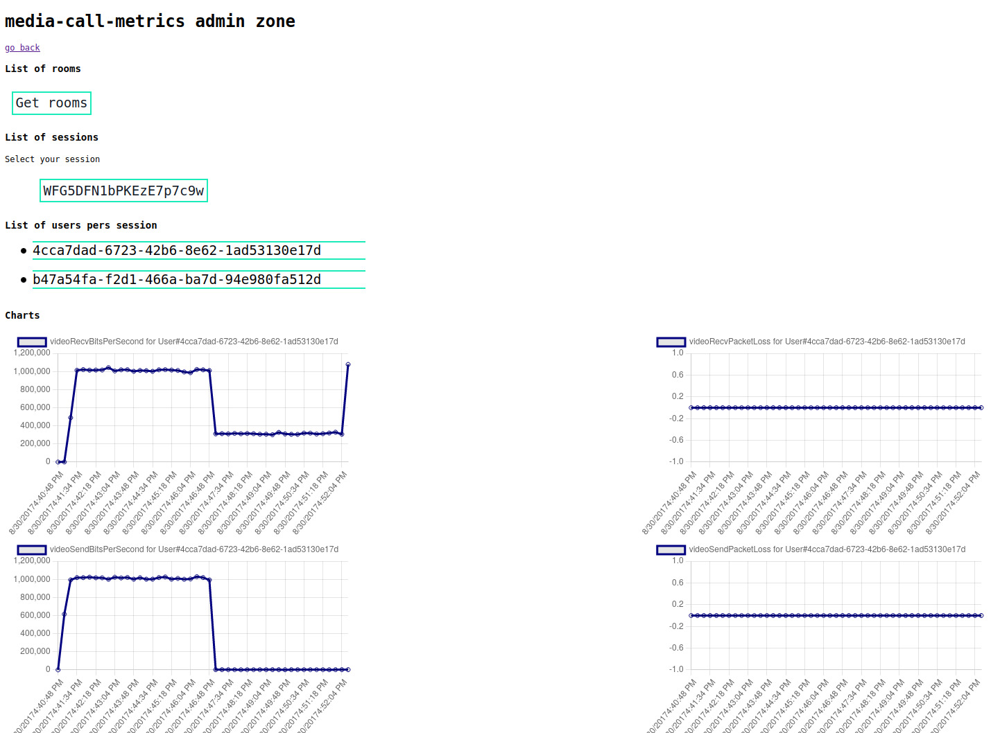

# media-call-metrics

Small proof-of-concept app for collecting and visualizing video stream metadata.

See demo here: [https://media-call-metrics.herokuapp.com/](https://media-call-metrics.herokuapp.com/)

## User goals

Public user goals:
- [x] can create a video conference room link
- [x] can send video conference link to friends
- [x] more than one user can do this at a time (conference IDs are generated and unique, not everyone joining the same room -- that's awkward)
- [ ] Stretch goal: pass in randomly generated but human-readable name
- [ ] Stretch goal: set rooms to auto-delete after X amount of minutes 

Administrator user goals:
- [x] can see dashboard with call history
- [x] can see details of a call
- [x] call details should include visualized charts for received/sent bits per second and received/sent packet loss
- [x] because calls have sessions, determine how to note those breaks, or if they should be separate charts
- [x] data should be at 15s granularity level
- [x] can click on each call to see call details
- [x] call details should be per user, not overall / for one user
- [ ] Stretch goal: admin user should be able to delete rooms from the dashboard
- [ ] Stretch goal: actual authentication!

## Getting started

These resources are helpful in getting up-to-speed with the Daily API:
- [Daily reference documentation](https://docs.daily.co/reference)
- [Deploy a Daily backend Node.js server instantly](https://www.daily.co/blog/deploy-a-daily-co-backend-node-js-server-instantly/)

## Development

To run this application locally, you will need:
- An API key from [Daily.co](https://daily.co), an audio/video API.
- `npm` installed and running on your computer. 

`npm` is a package manager for Node.js, which is used to build the server component of this application. Node.js is a JavaScript library for doing this kind of work. Even though `npm` is for Node.js, it also includes a lot of other libraries that allow this application to download everything it needs to run smoothly on your computer. You can find installation instructions and more information [here](https://www.npmjs.com/).

To get up and running:
- Clone this repository and open this directory in your terminal (`git clone git@github.com:ablwr/media-call-metrics.git && cd media-call-metrics`)
- Add your Daily.co API key to a `.env` file in the root of your folder, like this: `DAILY_API=your-api-key-here`
- Add `PORT=1337` to your `.env` file. This is not required, but it helps maintain a consistent URL.
- Run `npm install` to install dependencies
- Run `npm start` to start your server
- Go to [http://localhost:1337/](http://localhost:1337/) in your browser

## Deployment

This site can be readily deployed to sites such as [Glitch](https://glitch.com), [Netlify](https://netlify.app/), or [Heroku](https://herokuapp.com). Each platform has different requirements and documentation on how to import and deploy this repository.